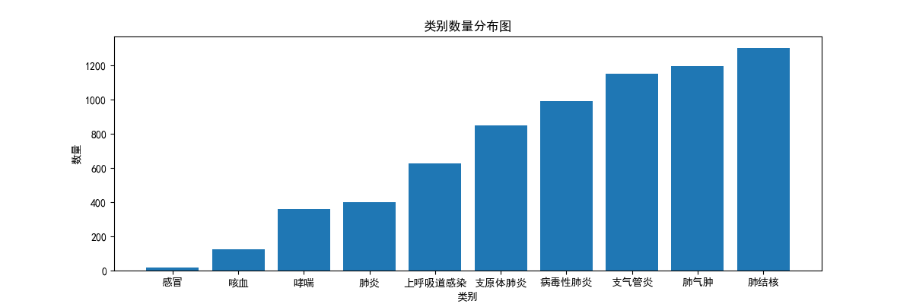
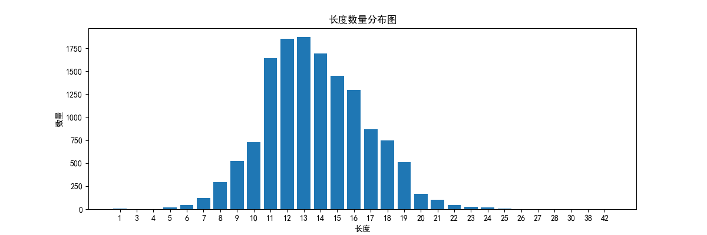
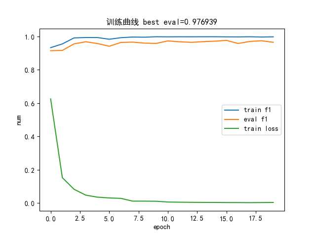
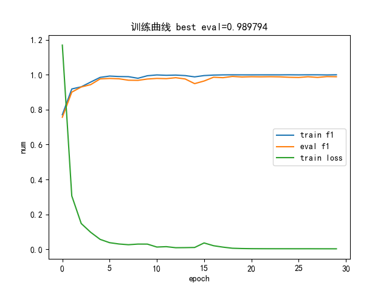
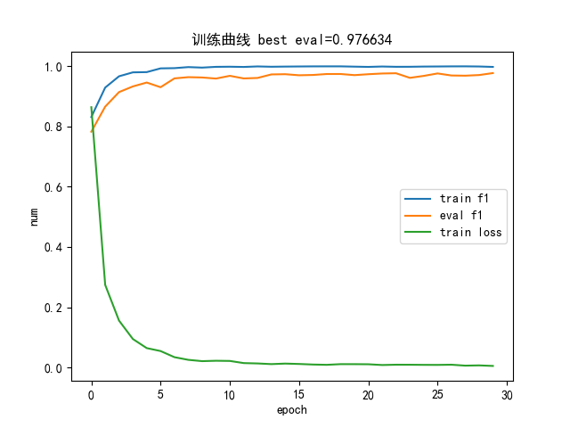

# 基于多模型的文本分类框架

---

- [X]  搭建基本baseline -21/12/10
- [X]  验证数据集分离，完成验证类 -22/1/2
- [X]  增加多模型，eg：cnn、bert -22/1/2
- [X]  超参数调优记录并画图 -22/1/2
- [ ]  保存模型与完成上线预测函数
- [ ]  上线到自己的云服务器

# 一，项目介绍

数据引用：[天池新冠问题数据](https://tianchi.aliyun.com/dataset/dataDetail?spm=5176.12281978.0.0.455f248bNzZ6Nf&dataId=76751)

bert模型|配置文件|字表引用：[在这个网页直接下载然后按照下面的目录放好就行，注意里面的pytorch_model.bin下载下来后名字会变，要重命名回来](https://huggingface.co/bert-base-chinese/tree/main)

## 1，原理

> 先分析数据的分布，然后用'lstm', 'gru', 'rnn', 'cnn', 'gated_cnn', 'rcnn', 'bert', 'bert_lstm', 'bert_mid' 等模型进行文本分类任务，框架完成后添加网格超参数搜索并记录最优模型以及训练数据，最后添加web服务，并进行模型的接口压力测试

## 2.项目结构

```bash
│  analysis_data.py  # 数据分析脚本
│  config.py  # 配置文件 
│  main.py  # 模型训练主流程（包含模型训练、保存最优模型、输出训练结果、超参数搜索等功能）
│  README.md
│
├─bert-base-chinese  # hugging face开源的bert-base
│      config.json
│      pytorch_model.bin
│      vocab.txt
|
├─src  # 核心代码
│  │  evaluater.py  # 评估脚本，画图脚本
│  │  loader.py  # 加载数据脚本
│  │  model.py  # 定义各种模型，包括'lstm', 'gru', 'rnn', 'cnn', 'gated_cnn', 'rcnn', 'bert', 'bert_lstm', 'bert_mid'
│  │  __init__.py
|
├─data  # 引用的开源数据
│      tianchi_data.csv
│
├─output  # 存放模型和数据分析文件（这里列出的模型都没上传，因为没必要，都可以根据说明简单训练出来，而且我的参数选的很小，因为只有一个小笔记本） 
|  ├─analysis  
│  │      类别数量分布图.png
│  │      长度数量分布图.png
│  └─model
│      │  models_comparison.csv  # 最终直接看的训练结果脚本，已经对每个模型排好序了
│      │
│      ├─bert
│      │      best.pth  # 未上传，后面的模型也是，都不写了，只是列出来参考一下
│      │      report.png  # 已上传，图片还是可以看看滴
│      │
│      ├─bert_lstm
│      │      best.pth
│      │      report.png
│      │
│      ├─bert_mid
│      │      best.pth
│      │      report.png
│      │
│      ├─cnn
│      │      best.pth  # 上传了这个模型，各位朋友可以直接用这个模型做后面的web接口压力测试
│      │      report.png  # 已上传，图片还是可以看看滴
│      │
│      ├─gated_cnn
│      │      best.pth
│      │      report.png
│      │
│      ├─gru
│      │      best.pth
│      │      report.png  # # 已上传，图片还是可以看看滴
│      │
│      ├─lstm
│      │      best.pth
│      │      report.png
│      │
│      ├─rcnn
│      │      best.pth
│      │      report.png
│      │
│      └─rnn
│              best.pth
│              report.png
```

## 3.数据分析以及模型结果展示

### ①.数据分析




### ②.模型结果（只列出来三个，其他都差不多）
> bert训练曲线



> gru训练曲线



> cnn训练曲线



### ③.整体训练结果

数据截取于:'./output/model/total_train_result_data.csv'


|    | model_type | learning_rate | hidden_size | optimizer | used_time   | best_f1     |
| ---- | ------------ | --------------- | ------------- | ----------- | ------------- | ------------- |
| 0  | lstm       | 0.01          | 64          | adam      | 7.594453096 | 0.985392144 |
| 1  | lstm       | 0.01          | 32          | adam      | 9.992699862 | 0.966093558 |
| 2  | lstm       | 0.001         | 64          | adam      | 7.646294594 | 0.92188352  |
| 94 | bert_lstm  | 0.001         | 32          | sgd       | 102.1858921 | 0.0655034   |
| 95 | bert_lstm  | 0.0001        | 32          | sgd       | 102.6064601 | 0.034667249 |
| 96 | bert_mid   | 0.0001        | 32          | adam      | 76.60139275 | 0.991444887 |
| 97 | bert_mid   | 0.001         | 32          | adam      | 76.11774898 | 0.988723785 |

# 二，项目使用

环境

```bash
pass
```

## 1.下载

`git clone git@github.com:eat-or-eat/dl-text-classify.git`

## 2.（可选）更换自己的数据

> 方法：仿照data中的数据构造，或者重写src.loader中的类即可

## 3.运行

### ①.生成数据分布图

`python analysis_data.py`

### ②.训练模型

> 这一步很耗时间，可以修改main里面的网格搜索来节约时间

`python main.py`

### 3.web接口测试

> 本地测试完后，可以修改端口然后放到自己的服务器然后开通访问权限就能用了

